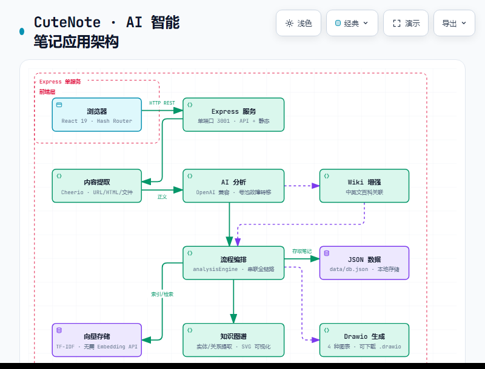

# CuteNote — AI 智能笔记应用

## 架构



> 可缩放交互版：[`docs/architecture.html`](docs/architecture.html)

---


基于 React 19 + Express 5 的全栈 AI 笔记应用，支持真实内容解析与多格式输出。

## 功能特性

- **多源内容解析**：支持 URL 链接、纯文本、文件上传（音频/视频/文档）
- **真实内容提取**：URL 自动抓取 + HTML 正文提取（Cheerio）
- **AI 内容分析**：任意 OpenAI 兼容 API（OpenRouter / DeepSeek / 智谱 / Moonshot / 自建）
- **Wikipedia 知识增强**：自动补充中英文百科关联信息
- **RAG 向量检索**：基于 Embeddings 或 TF-IDF 的语义搜索（单篇 + 跨笔记）
- **知识图谱**：AI 或规则提取实体/关系，SVG 力导向图可视化
- **Drawio 图表**：思维导图、结构框架图、知识图谱、流程图（可下载 .drawio）
- **多格式输出**：长图笔记、脑图、Markdown、结构化大纲、原文
- **AI 问答**：基于笔记内容的智能问答
- **无需登录**：所有功能本地运行

## 快速开始（单命令部署）

```bash
# 1. 克隆项目
git clone https://github.com/intp41455/cutenote-clone.git
cd cutenote-clone

# 2. 安装依赖
npm install

# 3. 配置环境变量（推荐 OpenRouter）
# .env 已预配置 OpenRouter，只需填入 API Key
# 获取 Key: https://openrouter.ai/keys
# 编辑 .env 第 2 行: OPENAI_API_KEY=sk-or-xxxxxxxxxxxx

# 4. 构建前端
npm run build

# 5. 启动服务（API + 前端，一个端口搞定）
npm start
```

访问 http://localhost:3001 即可使用完整应用。

## 环境变量

| 变量 | 必填 | 默认值 | 说明 |
|------|------|--------|------|
| `OPENAI_API_KEY` | 否 | 空 | API 密钥（不填则使用规则模式） |
| `OPENAI_BASE_URL` | 否 | `https://openrouter.ai/api/v1` | API 地址 |
| `CHAT_MODEL` | 否 | `gpt-4o` | 对话模型名称（用 `|` 分隔多个模型，自动故障转移） |
| `EMBEDDING_MODEL` | 否 | 空 | 向量模型（留空使用 TF-IDF） |
| `PORT` | 否 | `3001` | 服务端口 |

不配置 API Key 时，系统自动降级为规则模式（关键词提取、TF-IDF 向量、规则问答），所有功能仍可用。

**模型号池（故障转移）：** `CHAT_MODEL` 支持用 `|` 分隔多个模型，系统会按顺序尝试，一个模型失败后自动切换到下一个。例如：
```
CHAT_MODEL=google/gemma-4-31b-it:free|z-ai/glm-5.2:free|minimax/minimax-m3:free
```
当前已预配置 OpenRouter 免费模型号池（无需充值即可使用）。

### 推荐 API 提供商

| 提供商 | Base URL | 示例模型 |
|--------|----------|----------|
| **OpenRouter** (推荐) | `https://openrouter.ai/api/v1` | `anthropic/claude-sonnet-4`, `openai/gpt-4o` |
| DeepSeek | `https://api.deepseek.com/v1` | `deepseek-chat` |
| 智谱 | `https://open.bigmodel.cn/api/paas/v4` | `glm-4-plus` |
| Moonshot | `https://api.moonshot.cn/v1` | `moonshot-v1-32k` |
| OpenAI | `https://api.openai.com/v1` | `gpt-4o` |

## 开发模式

```bash
# 前后端分离开发
npm run dev:all

# 仅前端（Vite, 端口 5175）
npm run dev

# 仅后端（端口 3001）
npm run dev:server
```

## 技术架构

```
┌─────────────────────────────────────────────────┐
│  Express Server (port 3001)                      │
│  ├── /api/*          → REST API                  │
│  └── / (static)      → 前端静态文件 (dist/)       │
├─────────────────────────────────────────────────┤
│  Frontend (React 19 + Vite + Tailwind CSS)      │
│  ├── 笔记生成 (Hero.tsx)                         │
│  ├── 笔记详情 (8 个 Tab)                          │
│  ├── 我的笔记 / 公开笔记探索                        │
│  └── Hash Router (无依赖路由)                      │
├─────────────────────────────────────────────────┤
│  Server Modules                                  │
│  ├── aiClient.ts        — OpenAI 兼容 SDK         │
│  ├── contentExtractor   — URL/HTML/文件解析       │
│  ├── wikiSearch.ts      — Wikipedia API           │
│  ├── vectorStore.ts     — TF-IDF 向量数据库       │
│  ├── knowledgeGraph.ts  — 实体/关系提取            │
│  ├── drawioGenerator.ts — Drawio XML 生成          │
│  └── analysisEngine.ts  — 主流程编排               │
└─────────────────────────────────────────────────┘
```

## API 端点

| 方法 | 路径 | 说明 |
|------|------|------|
| GET | `/api/health` | 健康检查 + 配置状态 |
| GET | `/api/config` | AI 配置检查 |
| GET | `/api/public-notes` | 公开笔记列表 |
| GET | `/api/notes` | 我的笔记（分页/搜索） |
| POST | `/api/notes` | 创建笔记 |
| GET | `/api/notes/:id` | 笔记详情 |
| PUT | `/api/notes/:id` | 更新笔记 |
| DELETE | `/api/notes/:id` | 删除笔记 |
| POST | `/api/generation-jobs` | 创建生成任务 |
| GET | `/api/generation-jobs/:id` | 查询任务状态 |
| POST | `/api/search` | RAG 向量检索 |
| GET | `/api/knowledge-graph/:id` | 知识图谱 |
| GET | `/api/drawio/:id` | Drawio XML 下载 |
| GET | `/api/wiki-search?q=` | Wikipedia 检索 |

## 笔记详情 Tab 一览

1. **长图笔记** — 可视化长图卡片
2. **思维导图** — 结构化大纲展示
3. **Markdown** — 完整 Markdown 原文
4. **原文** — 原始输入内容
5. **知识图谱** — SVG 力导向图（实体/关系可视化）
6. **RAG 检索** — 语义搜索（单篇/跨笔记）
7. **Drawio** — 4 种图表预览 + 下载
8. **AI 问答** — 基于笔记内容的智能问答

## 项目结构

```
cutenote-clone/
├── server/
│   ├── index.ts              # Express 入口（API + 静态文件服务）
│   ├── types.ts              # 数据模型定义
│   └── modules/
│       ├── aiClient.ts       # OpenAI 兼容客户端
│       ├── contentExtractor  # URL/HTML/文件解析
│       ├── wikiSearch.ts     # Wikipedia 检索
│       ├── vectorStore.ts    # 向量存储（TF-IDF）
│       ├── knowledgeGraph.ts # 知识图谱提取
│       ├── drawioGenerator.ts# Drawio 图表生成
│       └── analysisEngine.ts # 分析流程编排
├── src/
│   ├── components/
│   │   ├── Hero.tsx          # 首页生成入口
│   │   ├── NoteDetailPage.tsx# 笔记详情（8 Tab）
│   │   ├── NoteEditor.tsx    # 笔记编辑器
│   │   ├── MyNotes.tsx       # 我的笔记
│   │   ├── ExplorePage.tsx   # 公开笔记探索
│   │   └── views/
│   │       ├── KnowledgeGraphView.tsx  # 知识图谱
│   │       ├── RagSearchView.tsx       # RAG 检索
│   │       └── DrawioView.tsx          # Drawio 图表
│   ├── lib/
│   │   ├── api.ts            # API 客户端
│   │   └── router.ts         # Hash 路由
│   ├── App.tsx
│   └── main.tsx
├── dist/                     # 生产构建输出（gitignore）
├── data/                     # 数据文件（gitignore）
├── package.json
├── vite.config.ts
├── .env.example
└── README.md
```

## License

MIT
